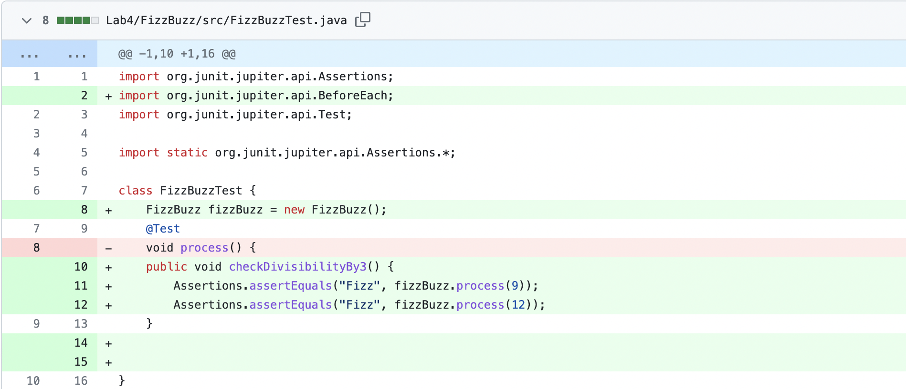
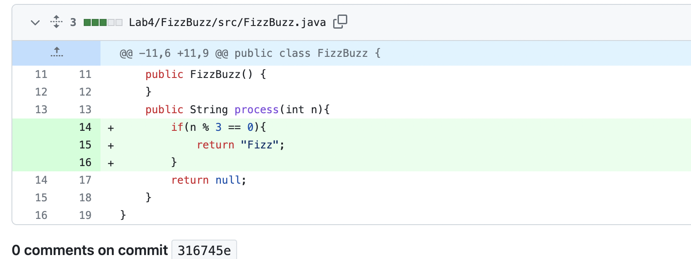
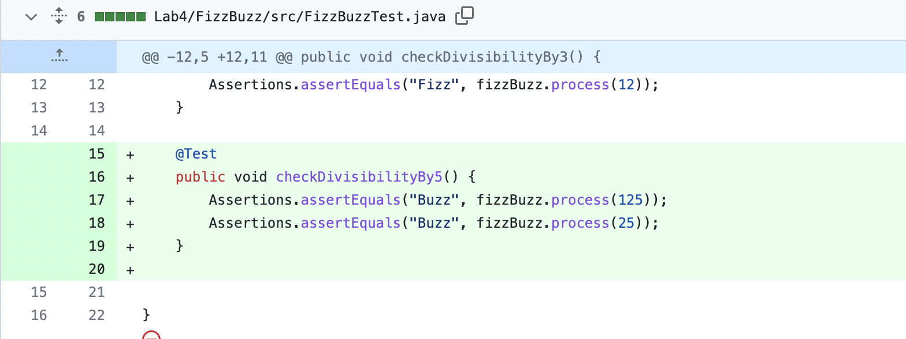
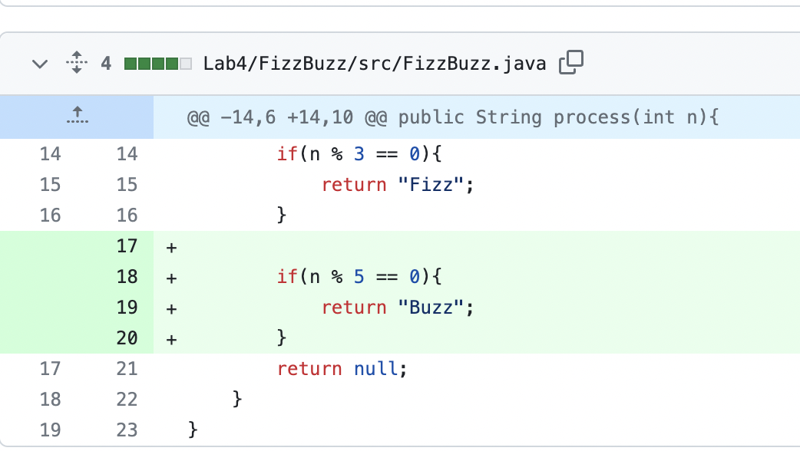
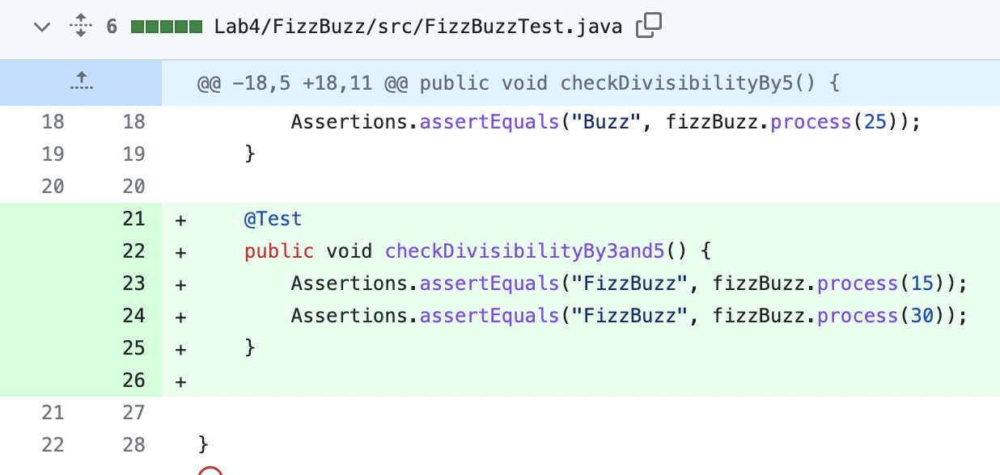
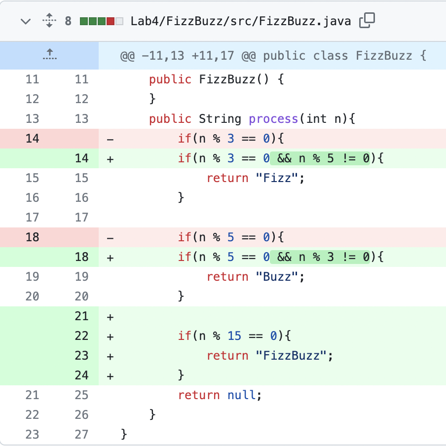
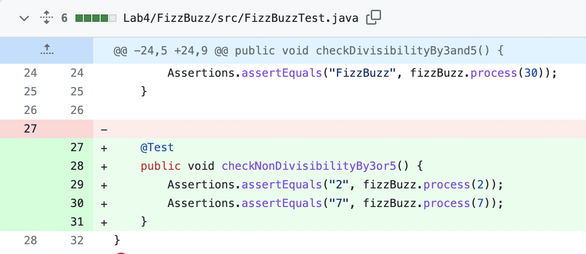
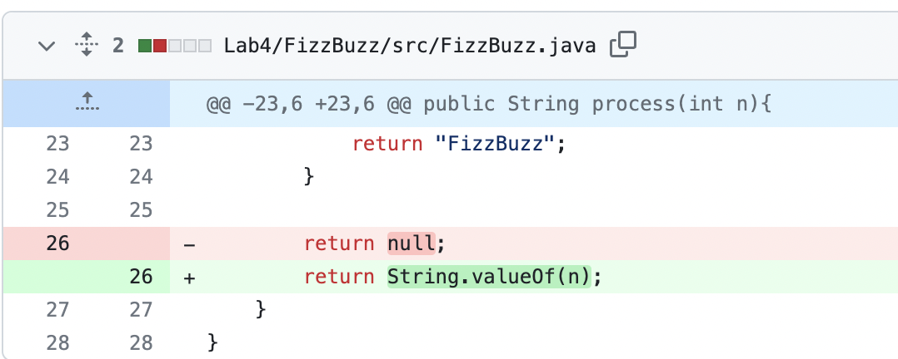
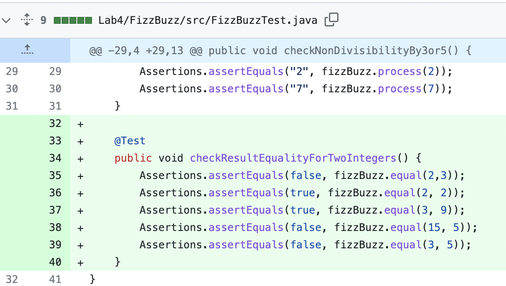

# seg3505_playground_lab4

@Author: Brice Joan Ngnawo Soh - nsoh087@uottawa.ca - 300262882

| Outline   | Value            |
| --------- | ---------------- |
| Course    | SEG 3503         |
| Date      | Summer 2023      |
| Professor | Mohammed Ibrahim |
| TA        | Joseph Abonasara |

|    Commit group/names    |            Commit number                  | Description |
|    ------------------    |            -------------                  | ----------- |
| Divisibility by 3 failed, Divisibility by 3 passed| 3be46caba229c00db4cac80e59542d00e47c8b74, 316745e537482426f30e27baecd962b93bd752e0 | Here we want to test if when the number is divisible by 3 it returns "Fizz". The test initially failed and the code was refactored for the test group to pass.                    Test:  Implementation:  
| Divisibility by 5 failed, Divisibility by 5 passed | f75dd9a8963d6318c119c6b3fd4edb63e1deba1d, 3e79e0118b580e39004f6717e9015826075232db| Here we want to test if when the number is divisible by 5 it returns "Buzz". The test initially failed and the code was refactored for the test group to pass.         Test:  Implementation: 
| Divisibility by 3 and 5 failed, Divisibility by 3 and 5 passed | e28d68ec4e816f55d197eb8f3902d531ccf79ff1, dc7236966b5502be3988006ec90cd2423fcc8f11| Here we want to test if when the number is divisible by 3 and 5 it returns "FizzBuzz". The test initially failed and the code was refactored for the test group to pass.     Test:  Implementation: 
| Non-Divisibility by 3 or 5 failed, Non-Divisibility by 3 or 5 passed | f45ddf6ca43f93e5a9b0b71878233b333302d432, b739bc5bbee186f2ada5608be03580c8d70cfb75| Here we want to test when the integer is not divisible by 3 or 5 it returns the integer. The test initially failed and the code was refactored for the test group to pass.     Test:  Implementation: 
| Check result equality for two integers failed, Check result equality for two integers passed | 60299d500a0a3ab9803a553981c4a976d3879de0, 53091b1a3b8c6e97390f8c642a1e1c62b021c736| Here we want to test if the result of two integers is equal or not. For example, 3 is "Fizz" and 9 is "Fizz" so we expect true. The test initially failed and the code was refactored for the test group to pass.     Test:  Implementation: 

